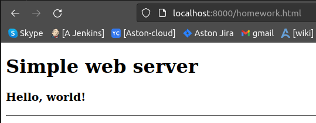
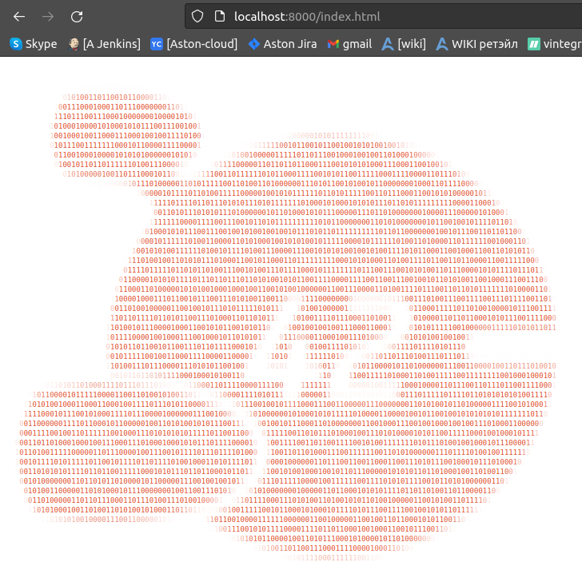

# ShamrockOo4tune_platform
ShamrockOo4tune Platform repository

## Домашняя работа №1
---

### Часть 1. Веб сервер со статикой

Согласно методических рекомендаций собран веб сервер для раздачи статичных страниц (индексная страница по умолчанию, homework.html)

Сервер на базе официального образа [nginx](https://hub.docker.com/_/nginx) 

Кастомизированы конфигурационные файлы сервера для запуска контейнера с **`UID 1001`**, заменены пути к дефолтным страницам и корню виртуального хоста по умолчанию.


Собирается и запускается локально:
```bash
$ docker build -t shamrockoo4tune/otus_k8s_hw1 .
Sending build context to Docker daemon  176.1kB
Step 1/6 : FROM nginx
 ---> 448a08f1d2f9
Step 2/6 : USER 1001
 ---> Using cache
 ---> 1ead2796c182
Step 3/6 : COPY app /*.html /var/www/html/
 ---> Using cache
 ---> c64315358054
Step 4/6 : COPY app/nginx.conf /etc/nginx/nginx.conf
 ---> Using cache
 ---> 2da718675c03
Step 5/6 : COPY app/default.conf /etc/nginx/conf.d/default.conf
 ---> Using cache
 ---> 3d66531491e5
Step 6/6 : EXPOSE 8000
 ---> Using cache
 ---> 5d54c2f77ce1
Successfully built 5d54c2f77ce1
Successfully tagged shamrockoo4tune/otus_k8s_hw1:latest
$
$ docker run -it --rm --name homework1 -p 8000:8000 shamrockoo4tune/otus_k8s_hw1:latest
/docker-entrypoint.sh: /docker-entrypoint.d/ is not empty, will attempt to perform configuration
/docker-entrypoint.sh: Looking for shell scripts in /docker-entrypoint.d/
/docker-entrypoint.sh: Launching /docker-entrypoint.d/10-listen-on-ipv6-by-default.sh
10-listen-on-ipv6-by-default.sh: info: Getting the checksum of /etc/nginx/conf.d/default.conf
10-listen-on-ipv6-by-default.sh: info: /etc/nginx/conf.d/default.conf differs from the packaged version
/docker-entrypoint.sh: Launching /docker-entrypoint.d/20-envsubst-on-templates.sh
/docker-entrypoint.sh: Launching /docker-entrypoint.d/30-tune-worker-processes.sh
/docker-entrypoint.sh: Configuration complete; ready for start up
```

Страницы доступны локально:  
  
<br>  


Собранный образ опубликован в dockerhub registry: [shamrockoo4tune/otus_k8s_hw1](https://hub.docker.com/r/shamrockoo4tune/otus_k8s_hw1)

Спулить:
```bash
$ docker pull shamrockoo4tune/otus_k8s_hw1
```
Деплой контейнеризированного приложения в k8s кластер на низкоуровневой абстракции (pod) через применение манифеста [./kubernetes-intro/web-pod.yaml](./kubernetes-intro/web-pod.yaml). Проброс портов на локальную машину:  

```bash
$ kubectl apply -f ./kubernetes-intro/web-pod.yaml
pod/web created
$ kubectl port-forward --address 0.0.0.0 pods/web 8000:8000
Forwarding from 0.0.0.0:8000 -> 8000
```
Переход на локацию /index.html отдает ожидаемую страницу:  
   
<br>  

---

### Часть 2. Фронтэнд часть Hipster Shop  

Склонировал [репо с Хипстерским магазином](https://github.com/GoogleCloudPlatform/microservices-demo) и контейреризировал фронтэнд:  
```bash  
~/microservices-demo/src/frontend$ docker build -t shamrockoo4tune/fe-hipstershop .
Sending build context to Docker daemon  4.452MB
Step 1/18 : FROM golang:1.20.
...
...
...
Successfully built 6f57bdf452aa
Successfully tagged shamrockoo4tune/fe-hipstershop:latest

~/microservices-demo/src/frontend$ docker push shamrockoo4tune/fe-hipstershop
...
```
Запуск в k8s:
```bash
~/microservices-demo/src/frontend$ cd ~/ShamrockOo4tune_platform/
~/ShamrockOo4tune_platform$ kubectl apply -f kubernetes-intro/frontend-pod-healthy.yaml 
pod/frontend created
~/ShamrockOo4tune_platform$ k get pods
NAME       READY   STATUS    RESTARTS   AGE
frontend   1/1     Running   0          18s
web        1/1     Running   0          24m
```

Ошибки в запуске контейнера были связаны с тем, что не были засэтены  некоторые переменные окружения. Проблема решается включением раздела **`env`** в спецификацию контейнера:  
```yaml
spec:
  containers:
  - image: shamrockoo4tune/fe-hipstershop
    name: frontend
    resources: {}
    env:
    - name: PRODUCT_CATALOG_SERVICE_ADDR
      value: "productcatalogservice:3550"
    - name: CURRENCY_SERVICE_ADDR
      value: "currencyservice:7000"
    - name: CART_SERVICE_ADDR
      value: "cartservice:7070"
    - name: RECOMMENDATION_SERVICE_ADDR
      value: "recommendationservice:8080"
    - name: SHIPPING_SERVICE_ADDR
      value: "shippingservice:50051"
    - name: CHECKOUT_SERVICE_ADDR
      value: "checkoutservice:5050"
    - name: AD_SERVICE_ADDR
      value: "adservice:9555"
  dnsPolicy: ClusterFirst
  restartPolicy: Never
```  
