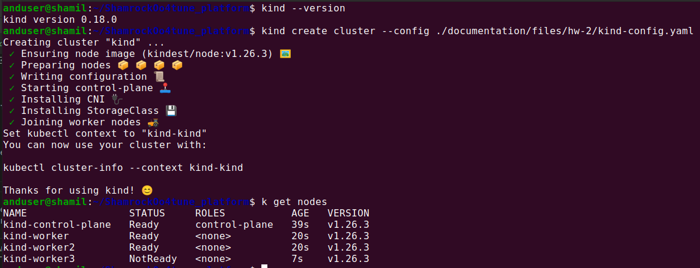
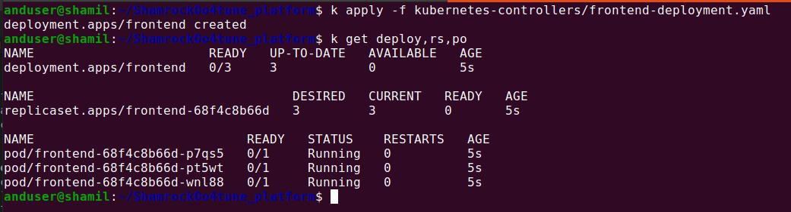
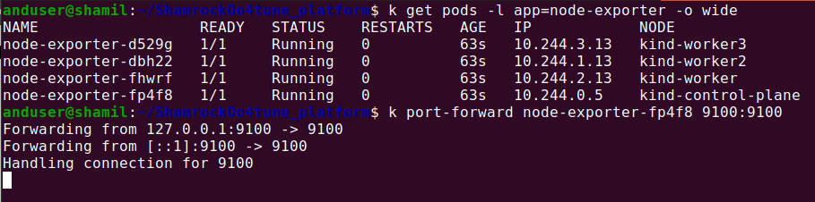

# Домашняя работа №2 
<br>  

## Часть 0. Подготовительная  
<br>  

### Кластер Kind  

Кластер Kind развернут локально из [манифеста](./files/hw-2/kind-config.yaml)  



---
<br>  

## Часть 1. ReplicaSet **(rs)**
<br>  

### Создание rs frontend   
Согласно методических рекомендаций, создал rs со своей сборкой микросервиса **`frontend`** из [манифеста](../kubernetes-controllers/frontend-replicaset.yaml)


В исходном манифесте не хватало селектора меток:  
```yaml
  selector:
   matchLabels:
      app: frontend
```  
<br>  

### Обновление rs frontend   

#### Вопрос: 
      Руководствуясь материалами лекции опишите произошедшую ситуацию, почему обновление ReplicaSet не повлекло обновление запущенных pod?

#### Ответ: 
      При изменении в манифесте rs, поменяли только версию образа. Селектор и метки подов остались те же. rs отслеживает поды по меткам. После применения обновленного манифеста он видит что ему нужно иметь 3 экземпляра подов с метками app=frontend. Но эта метка никак не отражает того факта, что версия пода должна быть v2.0.0
    Поды не могут быть изменены на месте, а только перевоссозданы, при необходимости.  
      Таким образом у rs есть цель - "иметь в системе 3 пода с метками app=frontend". Он проверяет состояние кластера - действительно, такие поды есть. Если поды со старой версией удалить, то rs это увидит и полезет за своим шаблоном создавать новые экземпляры. И они уже будут созданы с новой версией образа.
 

---

## Часть 2. Deployment  
<br>    

### Создание rs paymentservice   
Согласно методических рекомендаций, создал rs со своей сборкой микросервиса **`patmentService`** из [манифеста](../kubernetes-controllers/paymentservice-replicaset.yaml)  
<br>  

### Создание Deployment paymentservice  
Согласно методических рекомендаций, на основе rs для микросервиса **`patmentService`** создал Deplyment из [манифеста](../kubernetes-controllers/paymentservice-deployment.yaml)  
Проверил его работоспособность:  
  
<br>  

### Задание со *

#### Аналог **`blue-green`** deployment
    Задача: 
      С использованием параметров maxSurge и maxUnavailable реализовать аналог blue-green deployment:    
      1. Развертывание трех новых pod;  
      2. Удаление трех старых pod;    

    Решение:  
      Добавил к базовому варианту манифеста следующий фрагмент:   
```yaml
  strategy:
    rollingUpdate:
      maxUnavailable: 0
      maxSurge: 100%
```  
      Получился манифест [paymentservice-deployment-bg.yaml](../kubernetes-controllers/paymentservice-deployment-bg.yaml)  
<br>  

#### Аналог **`Reverse Rolling Update`**  
    Задача: 
      С использованием параметров maxSurge и maxUnavailable реализовать аналог Reverse Rolling Update    
      1. Удаление одного старого pod;  
      2. Создание одного нового pod; 
      3. ...     
    Решение:  
      Добавил к базовому варианту манифеста следующий фрагмент:   
```yaml
  strategy:
    rollingUpdate:
      maxUnavailable: 1
      maxSurge: 0
```  

Получился манифест [paymentservice-deployment-bg.yaml](../kubernetes-controllers/paymentservice-deployment-reverse.yaml)   

<br>  

### Probes  
Согласно методических рекомендаций, на основе rs для микросервиса **`frontend`** создал Deplyment из [манифеста](../kubernetes-controllers/frontend-deployment.yaml). Добавил в него readinesProbe.  

---  
<br>  

## Часть 3. DaemonSet  
<br>    

Для выполнения задания использовал образ [bitnami/node-exporter](https://hub.docker.com/r/bitnami/node-exporter)  

Создал DaemonSet из [манифеста](../kubernetes-controllers/node-exporter-daemonset.yaml).

### DaemonSet Задание **
Развернуть DaemonSet на control-plane (мастер ноде)  
Для этого добавил в спецификацию `tolerations`:
```yaml
      tolerations:
      - key: node-role.kubernetes.io/control-plane
        operator: Exists
        effect: NoSchedule
```  

